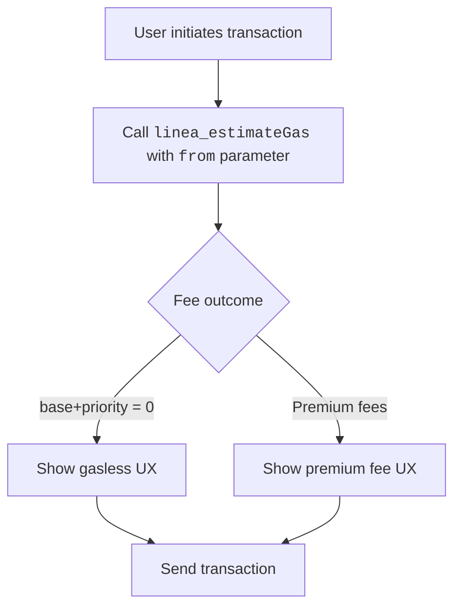

import Tabs from '@theme/Tabs';
import TabItem from '@theme/TabItem';

Status Network provides gasless transactions at the protocol level. You do not need paymasters or relayers. As a builder, the core task is to estimate and present fees correctly per sender state.

:::important The key rule
Use `linea_estimateGas` RPC method as the source of truth for gas fee when preparing transaction UX.
:::

For other JSON-RPC method reference, see [JSON-RPC API](/build-for-karma/rpc/json-rpc).

## Karma-aware fee estimation

On Linea, [`linea_estimateGas`](https://docs.linea.build/api/reference/linea-estimategas) is already the recommended way to estimate gas.
It returns `gasLimit`, `baseFeePerGas`, and `priorityFeePerGas` in a **single call**, where the fee fields account for compressed transaction size, layer-1 verification costs, and the L1/L2 gas-price ratio - factors that `eth_` namespace methods do not capture.

Status Network extends `linea_estimateGas` further so that the fee fields also incorporate our **Karma** system; fees may be reduced to zero for eligible users, or increased for deny-listed users.



*Figure: Gas estimation flow using `linea_estimateGas`*

This is why builders should use `linea_estimateGas` when estimating transaction costs or pre-filling EIP-1559 fee fields for users on Status Network.

:::info for more
For a detailed explanation of Karma and its impact on gas fees and transaction privileges, see the [Karmic Tokenomics](../../overview/tokenomics/karmic-tokenomics) page.

For the technical details of how our gasless system is implemented and enforced, refer to the [Gasless Transactions](../../overview/general-info/gasless-transactions) documentation.
:::

## `linea_estimateGas` request/response shape

### Request

`linea_estimateGas` takes the **same transaction call object** as `eth_estimateGas`.
It returns `gasLimit` (using the same EVM execution logic as `eth_estimateGas`) together with fee fields that reflect both Linea's L2-specific pricing and Status Network's Karma rules - all in a single response.

:::important
**Always include `from`.** Without it, the node can't apply Karma/quota/deny-list logic.
:::

### Response

`linea_estimateGas` returns an object including:

- `gasLimit`: hex quantity - estimated gas units for EVM execution (same calculation as `eth_estimateGas`)
- `baseFeePerGas`: hex quantity - base fee for the next block, accounting for Karma rules on Status Network
- `priorityFeePerGas`: hex quantity - suggested priority fee, accounting for Karma rules on Status Network

These fee fields may differ significantly from the values returned by `eth_` namespace calls such as `eth_gasPrice`, `eth_maxPriorityFeePerGas`, or `eth_feeHistory`, which are not aware of Linea's L2-specific pricing or Status Network's Karma adjustments.

<!-- markdownlint-disable MD033 -->
<Tabs groupId="estimate-gas-response-shape">
  <TabItem value="linea" label="linea_estimateGas (single call)">

```json
{
  "jsonrpc": "2.0",
  "id": 1,
  "result": {
    "gasLimit": "0x5208",
    "baseFeePerGas": "0x0",
    "priorityFeePerGas": "0x0"
  }
}
```

  </TabItem>
  <TabItem value="eth" label="Standard EVM (multiple calls)">

Standard EVM flows require multiple separate `eth_` calls to gather gas limit and fee data:

**eth_estimateGas**

```json
{
  "jsonrpc": "2.0",
  "id": 1,
  "result": "0x5208"
}
```

**eth_maxPriorityFeePerGas**

```json
{
  "jsonrpc": "2.0",
  "id": 2,
  "result": "0x59682f00"
}
```

**eth_getBlockByNumber**

```json
{
  "jsonrpc": "2.0",
  "id": 3,
  "result": {
    "number": ...,
    "baseFeePerGas": "0x3b9aca00",
    ...
  }
}
```

  </TabItem>
</Tabs>
<!-- markdownlint-enable MD033 -->

## Migration guide: from multiple `eth_` calls to `linea_estimateGas`

This section shows how to migrate from the common "EIP-1559 via multiple `eth_` calls" flow to a single `linea_estimateGas` call, which provides more accurate L2-specific fee data and Karma-aware pricing on Status Network.

### Before: common EIP-1559 estimation flow on EVM chains using `eth_` namespaces

On many EVM chains, a typical EIP-1559 estimation flow looks like:

1. **Estimate gas limit** via `eth_estimateGas`
2. **Fetch `maxPriorityFeePerGas`** via `eth_maxPriorityFeePerGas` and/or `eth_feeHistory`
3. **Fetch `baseFeePerGas`** via `eth_getBlockByNumber`
4. Build an EIP-1559 transaction using:
   - `gas`
   - `maxPriorityFeePerGas`
   - `maxFeePerGas`, often $2 \cdot \mathrm{baseFeePerGas} + \mathrm{maxPriorityFeePerGas}$

<!-- markdownlint-disable MD033 -->
<Tabs groupId="eip1559-estimation-before">
  <TabItem value="curl" label="curl">

```bash
# 1) Gas limit (EVM execution)
curl -X POST -H "Content-Type: application/json" \
  --data '{
    "jsonrpc":"2.0",
    "id":1,
    "method":"eth_estimateGas",
    "params":[{
      "from":"0xYOUR_SENDER",
      "to":"0xCONTRACT_OR_RECIPIENT",
      "data":"0xYOUR_CALLDATA",
      "value":"0x0"
    }]
  }' \
  https://YOUR_RPC_URL

# 2) Fetch suggested tip amount
curl -X POST -H "Content-Type: application/json" \
  --data '{"jsonrpc":"2.0","id":2,"method":"eth_maxPriorityFeePerGas","params":[]}' \
  https://YOUR_RPC_URL

# 3) Fetch base fee
curl -X POST -H "Content-Type: application/json" \
  --data '{"jsonrpc":"2.0","id":3,"method":"eth_getBlockByNumber","params":["pending",false]}' \
  https://YOUR_RPC_URL
```

  </TabItem>
  <TabItem value="ethers" label="ethers.js">

```js
import { ethers } from 'ethers';

const provider = new ethers.JsonRpcProvider('https://YOUR_RPC_URL');

const call = {
  from: '0xYOUR_SENDER',
  to: '0xCONTRACT_OR_RECIPIENT',
  data: '0xYOUR_CALLDATA',
  value: '0x0',
};

const gas = await provider.estimateGas(call);
const maxPriorityFeePerGas = await provider.send('eth_maxPriorityFeePerGas', []);
const pendingBlock = await provider.getBlock('pending');

const baseFeePerGas = pendingBlock?.baseFeePerGas ?? 0n;
const maxFeePerGas = 2n * baseFeePerGas + BigInt(maxPriorityFeePerGas);

console.log({
  gas: `0x${gas.toString(16)}`,
  maxPriorityFeePerGas,
  maxFeePerGas: `0x${maxFeePerGas.toString(16)}`,
});
```

  </TabItem>
  <TabItem value="viem" label="viem">

```js
import { createPublicClient, http } from 'viem';

const client = createPublicClient({
  transport: http('https://YOUR_RPC_URL'),
});

const call = {
  account: '0xYOUR_SENDER',
  to: '0xCONTRACT_OR_RECIPIENT',
  data: '0xYOUR_CALLDATA',
  value: 0n,
};

const gas = await client.estimateGas(call);
const maxPriorityFeePerGas = await client.getMaxPriorityFeePerGas();
const pendingBlock = await client.getBlock({ blockTag: 'pending' });

const baseFeePerGas = pendingBlock.baseFeePerGas ?? 0n;
const maxFeePerGas = 2n * baseFeePerGas + maxPriorityFeePerGas;

console.log({
  gas,
  maxPriorityFeePerGas,
  maxFeePerGas,
});
```

  </TabItem>
</Tabs>
<!-- markdownlint-enable MD033 -->

### After: Status Network gas estimation flow using `linea_estimateGas`

On Status Network, you should source fee suggestions from `linea_estimateGas`, because the correct fee recommendation depends on Karma:

- accounts may be eligible for **gasless** transactions
- deny-listed accounts may need to pay a **premium gas fee**

<!-- markdownlint-disable MD033 -->
<Tabs groupId="linea-estimate-gas-request">
  <TabItem value="curl" label="curl">

```bash
curl -X POST -H "Content-Type: application/json" \
  --data '{
    "jsonrpc":"2.0",
    "id":1,
    "method":"linea_estimateGas",
    "params":[{
      "from":"0xYOUR_SENDER",
      "to":"0xCONTRACT_OR_RECIPIENT",
      "data":"0xYOUR_CALLDATA",
      "value":"0x0"
    }]
  }' \
  https://YOUR_STATUS_NETWORK_RPC_URL
```

  </TabItem>
  <TabItem value="ethers" label="ethers.js">

```js
import { ethers } from 'ethers';

const provider = new ethers.JsonRpcProvider('https://YOUR_STATUS_NETWORK_RPC_URL');

const call = {
  from: '0xYOUR_SENDER',
  to: '0xCONTRACT_OR_RECIPIENT',
  data: '0xYOUR_CALLDATA',
  value: '0x0',
};

const { gasLimit, baseFeePerGas, priorityFeePerGas } = await provider.send(
  'linea_estimateGas',
  [call],
);

const maxFeePerGas =
  BigInt(baseFeePerGas) + BigInt(priorityFeePerGas);

console.log({
  gas: gasLimit,
  maxPriorityFeePerGas: priorityFeePerGas,
  maxFeePerGas: `0x${maxFeePerGas.toString(16)}`,
});
```

  </TabItem>
  <TabItem value="viem" label="viem">

```js
import { createPublicClient, http } from 'viem';

const client = createPublicClient({
  transport: http('https://YOUR_STATUS_NETWORK_RPC_URL'),
});

const call = {
  from: '0xYOUR_SENDER',
  to: '0xCONTRACT_OR_RECIPIENT',
  data: '0xYOUR_CALLDATA',
  value: 0n,
};

const { gasLimit, baseFeePerGas, priorityFeePerGas } = await client.request({
  method: 'linea_estimateGas',
  params: [call],
});

const maxFeePerGas =
  BigInt(baseFeePerGas) + BigInt(priorityFeePerGas);

console.log({
  gas: gasLimit,
  maxPriorityFeePerGas: priorityFeePerGas,
  maxFeePerGas: `0x${maxFeePerGas.toString(16)}`,
});
```

  </TabItem>
</Tabs>
<!-- markdownlint-enable MD033 -->

:::tip Tooling integration
Many Ethereum libraries call `eth_estimateGas` internally (for example, `provider.estimateGas(...)`).  On Status Network, keep using those libraries for standard `eth_` methods, but **fetch estimates via `linea_estimateGas` explicitly for gas limit and fee fields** wherever you build or display transaction parameters for users.
:::

## Handling fee scenarios in UI

### 1) Gasless

When `baseFeePerGas` and `priorityFeePerGas` are both zero:

- Display a clear free-transaction state.
- Skip unnecessary fee warnings.

### 2) Premium fees

When sender is deny-listed (exceeded quota or RLN policy):

- Show the fee amount and explain that premium gas applies due to quota or spam policy.
- Make clear the sender can pay the fee or wait for their quota window to refresh.
- Keep the transaction possible; do not hard-block.

## Common pitfalls

| Pitfall | Fix |
|---|---|
| Using `eth_` methods for fee decisions (`eth_gasPrice`, `eth_maxPriorityFeePerGas`, `eth_feeHistory`) | Use `linea_estimateGas` |
| Omitting `from` when calling `linea_estimateGas` | Always pass the sender address to receive Karma-aware estimation |
| Hardcoding fee assumptions | Build fee UI from returned `baseFeePerGas` and `priorityFeePerGas` values |
| Assuming all users are gasless | Handle both states: gasless (zero fees) and deny-listed (premium fees) |
| Caching estimates across retries | Re-estimate near send time — sender Karma state can change |

## Next steps

- [JSON-RPC API](/build-for-karma/rpc/json-rpc)
- [Reputation Integration](/build-for-karma/reputation-integration)
