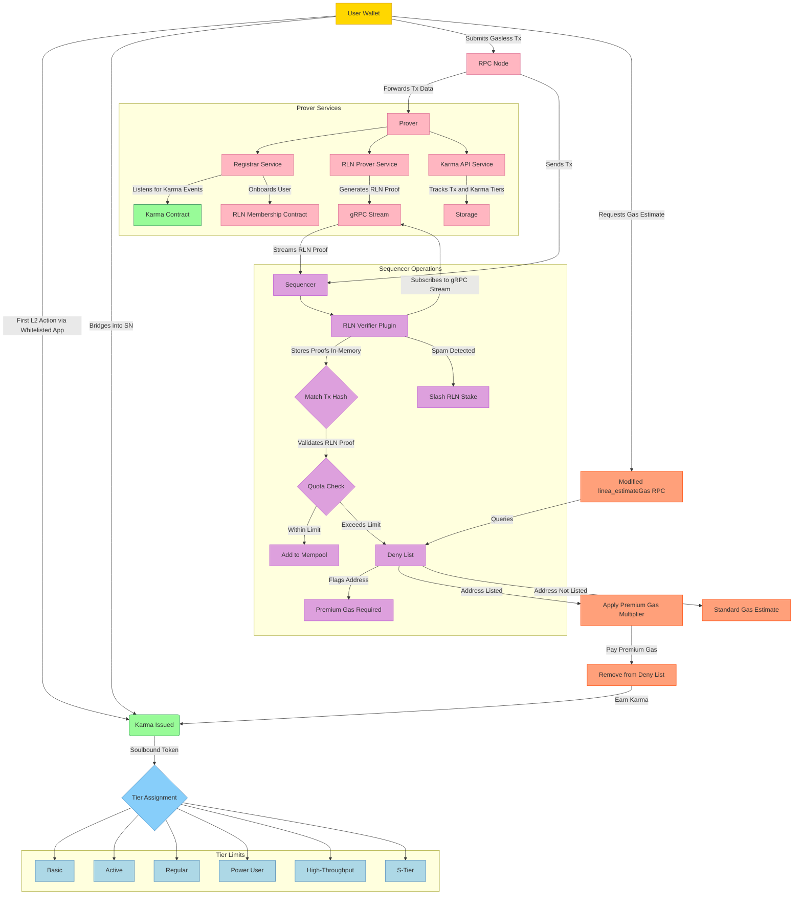

# Gasless Transactions in Status Network

Status Network aims to introduce gasless transactions at scale. The key component of this gasless approach is Vac's Rate Limiting Nullifier, which permits transaction rate limitation without the need for traditional gas fees. The document describes the architecture and integration elements needed to safely enable gasless transactions.

### 1.2 RLN

RLN is a zero-knowledge system designed to prevent spam without compromising user privacy unless a violation occurs. It replaces traditional gas fees with cryptographic rate limits enforced via ZKPs and Shamir's Secret Sharing.

RLN characteristics:

- **Zero-Knowledge Proofs:** Users generate ZKPs verifying their RLN group membership without revealing their identity. The group membership indicates the maximum gasless transaction throughput for each tier.
- **Shamir's Secret Sharing and Nullifiers:** Users hold a secret key used to generate unique nullifiers for transactions. If a user exceeds their transaction limit within an epoch (e.g., block or timestamp), their secret key becomes recoverable, exposing them.
- **Spam Detection:** Users exceeding limits effectively reveal their secret, leading to penalties like Deny List inclusion, higher future gas costs, or potential token slashing.

### 1.3. RLN Membership Management

RLN uses Sparse Merkle Trees to efficiently handle large-scale membership proofs. A benchmarking study determined that a tree height of 20, supporting 1 million accounts, provides optimal performance for proof generation and verification. For scalability beyond 1 million accounts, multiple SMTs can be used with a registry to direct users to the appropriate tree.

The Prover includes a Registrar Service that listens for events from the Karma Contract, where Karma is allocated to new addresses. Upon detecting such an event, the Registrar Service onboards the user to the RLN Membership Contract by generating and registering their RLN credentials (identitySecretHash and identityCommitment). The RLN Prover Service generates proofs for transactions, which are streamed via gRPC to the RLN Verifier in the Sequencer. The Verifier stores these proofs in memory and matches them with incoming transactions based on transaction hashes, as the process is asynchronous.

## 3. System Components

### 3.1 Prover

The Prover is a system comprising three services:

1. **Registrar Service**: Listens for Karma allocation events from the Karma Contract. When a new address receives Karma, it onboards the user to the RLN Membership Contract by generating RLN credentials and registering them.
2. **RLN Prover Service**: Generates RLN proofs for transactions using the Zerokit library. Proofs are streamed directly to the RLN Verifier in the Sequencer via a gRPC stream.
3. **Karma API Service**: Tracks transactions made by users within an epoch and maintains their Karma tier status. It stores transaction data in an internal database for efficient querying and tier management.

These services ensure secure credential management, proof generation, and transaction tracking, with gRPC enabling low-latency communication with the Sequencer.

### 3.2 RLN Verifier

The RLN Verifier is a besu plugin inside the sequencer, leveraging RLN's Zerokit Rust library via Java Native Interface. [A PoC verified JNI feasibility.](https://github.com/nadeemb53/verify-rln-proofs-java)
The Verifier:

- Subscribes to the gRPC stream from the RLN Prover Service to receive RLN proofs as they are generated.
- Stores proofs in memory and matches them with incoming transactions based on transaction hashes, accounting for the asynchronous arrival of transactions (via RPC Node) and proofs (via gRPC).
- Verifies proof authenticity, nullifier uniqueness, and user transaction quotas.

Transactions failing verification are rejected, and users may be temporarily added to the Deny List.

### 3.3 Deny List

The Deny List temporarily restricts users exceeding quotas or engaging in spam:

- Entries expire after a set duration (e.g., hours or days) based on the throughput tiers
- Users can bypass restrictions by paying premium gas fees
- Paying premium fees removes users from the list and earns additional Karma

### 3.4 `linea_estimateGas` RPC Modification

The linea_estimateGas method is customised to account for users on the Deny List:

- Checks user's Deny List status
- Adds premium gas multipliers if needed
- Provides transparency and accurate gas estimations to the users
