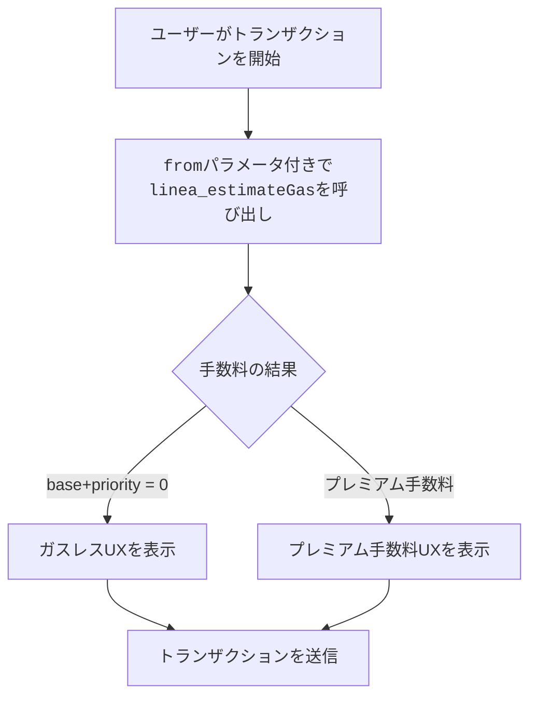

import Tabs from '@theme/Tabs';
import TabItem from '@theme/TabItem';

Status Networkはプロトコルレベルでガスレストランザクションを提供します。ペイマスターやリレイヤーは不要です。ビルダーとしての中心的なタスクは、送信者の状態に応じて手数料を正確に推定し表示することです。

:::important 基本ルール
トランザクションUXを準備する際、ガス手数料の信頼できるソースとして`linea_estimateGas` RPCメソッドを使用してください。
:::

その他のJSON-RPCメソッドのリファレンスについては、[JSON-RPC API](/build-for-karma/rpc/json-rpc)を参照してください。

## Karma対応の手数料推定

Lineaでは、[`linea_estimateGas`](https://docs.linea.build/api/reference/linea-estimategas)はすでにガス推定の推奨メソッドです。
**1回の呼び出し**で`gasLimit`、`baseFeePerGas`、`priorityFeePerGas`を返し、手数料フィールドは圧縮されたトランザクションサイズ、L1検証コスト、L1/L2ガス価格比率を反映します — `eth_`名前空間のメソッドでは把握できない要素です。

Status Networkは`linea_estimateGas`をさらに拡張し、手数料フィールドに**Karma**システムを組み込んでいます。対象ユーザーの手数料がゼロに削減されたり、拒否リストに載ったユーザーの手数料が増加したりする場合があります。



*図: `linea_estimateGas`を使用したガス推定フロー*

これが、ビルダーがStatus Networkでトランザクションコストの推定やユーザー向けEIP-1559手数料フィールドの事前入力に`linea_estimateGas`を使用すべき理由です。

:::info 詳細
Karmaとガス手数料およびトランザクション特権への影響に関する詳細な説明は、[カルミックトークノミクス](../../overview/tokenomics/karmic-tokenomics)ページを参照してください。

ガスレスシステムの実装と適用方法の技術的な詳細は、[ガスレストランザクション](../../overview/general-info/gasless-transactions)ドキュメントを参照してください。
:::

## `linea_estimateGas`のリクエスト/レスポンス形式

### リクエスト

`linea_estimateGas`は`eth_estimateGas`と**同じトランザクション呼び出しオブジェクト**を受け取ります。
`gasLimit`（`eth_estimateGas`と同じEVM実行ロジックを使用）と、LineaのL2固有の価格設定とStatus NetworkのKarmaルールの両方を反映した手数料フィールドを、単一のレスポンスで返します。

:::important
**必ず`from`を含めてください。** これがないと、ノードはKarma/クォータ/拒否リストのロジックを適用できません。
:::

### レスポンス

`linea_estimateGas`は以下を含むオブジェクトを返します:

- `gasLimit`: 16進数 - EVM実行のための推定ガスユニット（`eth_estimateGas`と同じ計算）
- `baseFeePerGas`: 16進数 - Status NetworkのKarmaルールを反映した次のブロックの基本手数料
- `priorityFeePerGas`: 16進数 - Status NetworkのKarmaルールを反映した推奨優先手数料

これらの手数料フィールドは、`eth_gasPrice`、`eth_maxPriorityFeePerGas`、`eth_feeHistory`などの`eth_`名前空間の呼び出しが返す値とは大きく異なる場合があります。これらはLineaのL2固有の価格設定やStatus NetworkのKarma調整を認識していません。

<!-- markdownlint-disable MD033 -->
<Tabs groupId="estimate-gas-response-shape">
  <TabItem value="linea" label="linea_estimateGas（単一呼び出し）">

```json
{
  "jsonrpc": "2.0",
  "id": 1,
  "result": {
    "gasLimit": "0x5208",
    "baseFeePerGas": "0x0",
    "priorityFeePerGas": "0x0"
  }
}
```

  </TabItem>
  <TabItem value="eth" label="標準EVM（複数呼び出し）">

標準EVMフローでは、ガスリミットと手数料データを収集するために複数の`eth_`呼び出しが必要です:

**eth_estimateGas**

```json
{
  "jsonrpc": "2.0",
  "id": 1,
  "result": "0x5208"
}
```

**eth_maxPriorityFeePerGas**

```json
{
  "jsonrpc": "2.0",
  "id": 2,
  "result": "0x59682f00"
}
```

**eth_getBlockByNumber**

```json
{
  "jsonrpc": "2.0",
  "id": 3,
  "result": {
    "number": ...,
    "baseFeePerGas": "0x3b9aca00",
    ...
  }
}
```

  </TabItem>
</Tabs>
<!-- markdownlint-enable MD033 -->

## 移行ガイド: 複数の`eth_`呼び出しから`linea_estimateGas`へ

このセクションでは、一般的な「複数の`eth_`呼び出しによるEIP-1559」フローから単一の`linea_estimateGas`呼び出しへの移行方法を説明します。Status Networkでより正確なL2固有の手数料データとKarma対応の価格設定を提供します。

### 移行前: `eth_`名前空間を使用したEVMチェーンでの一般的なEIP-1559推定フロー

多くのEVMチェーンでは、一般的なEIP-1559推定フローは次のようになります:

1. **ガスリミットの推定** — `eth_estimateGas`
2. **`maxPriorityFeePerGas`の取得** — `eth_maxPriorityFeePerGas`および/または`eth_feeHistory`
3. **`baseFeePerGas`の取得** — `eth_getBlockByNumber`
4. 以下を使用してEIP-1559トランザクションを構築:
   - `gas`
   - `maxPriorityFeePerGas`
   - `maxFeePerGas`、通常は $2 \cdot \mathrm{baseFeePerGas} + \mathrm{maxPriorityFeePerGas}$

<!-- markdownlint-disable MD033 -->
<Tabs groupId="eip1559-estimation-before">
  <TabItem value="curl" label="curl">

```bash
# 1) Gas limit (EVM execution)
curl -X POST -H "Content-Type: application/json" \
  --data '{
    "jsonrpc":"2.0",
    "id":1,
    "method":"eth_estimateGas",
    "params":[{
      "from":"0xYOUR_SENDER",
      "to":"0xCONTRACT_OR_RECIPIENT",
      "data":"0xYOUR_CALLDATA",
      "value":"0x0"
    }]
  }' \
  https://YOUR_RPC_URL

# 2) Fetch suggested tip amount
curl -X POST -H "Content-Type: application/json" \
  --data '{"jsonrpc":"2.0","id":2,"method":"eth_maxPriorityFeePerGas","params":[]}' \
  https://YOUR_RPC_URL

# 3) Fetch base fee
curl -X POST -H "Content-Type: application/json" \
  --data '{"jsonrpc":"2.0","id":3,"method":"eth_getBlockByNumber","params":["pending",false]}' \
  https://YOUR_RPC_URL
```

  </TabItem>
  <TabItem value="ethers" label="ethers.js">

```js
import { ethers } from 'ethers';

const provider = new ethers.JsonRpcProvider('https://YOUR_RPC_URL');

const call = {
  from: '0xYOUR_SENDER',
  to: '0xCONTRACT_OR_RECIPIENT',
  data: '0xYOUR_CALLDATA',
  value: '0x0',
};

const gas = await provider.estimateGas(call);
const maxPriorityFeePerGas = await provider.send('eth_maxPriorityFeePerGas', []);
const pendingBlock = await provider.getBlock('pending');

const baseFeePerGas = pendingBlock?.baseFeePerGas ?? 0n;
const maxFeePerGas = 2n * baseFeePerGas + BigInt(maxPriorityFeePerGas);

console.log({
  gas: `0x${gas.toString(16)}`,
  maxPriorityFeePerGas,
  maxFeePerGas: `0x${maxFeePerGas.toString(16)}`,
});
```

  </TabItem>
  <TabItem value="viem" label="viem">

```js
import { createPublicClient, http } from 'viem';

const client = createPublicClient({
  transport: http('https://YOUR_RPC_URL'),
});

const call = {
  account: '0xYOUR_SENDER',
  to: '0xCONTRACT_OR_RECIPIENT',
  data: '0xYOUR_CALLDATA',
  value: 0n,
};

const gas = await client.estimateGas(call);
const maxPriorityFeePerGas = await client.getMaxPriorityFeePerGas();
const pendingBlock = await client.getBlock({ blockTag: 'pending' });

const baseFeePerGas = pendingBlock.baseFeePerGas ?? 0n;
const maxFeePerGas = 2n * baseFeePerGas + maxPriorityFeePerGas;

console.log({
  gas,
  maxPriorityFeePerGas,
  maxFeePerGas,
});
```

  </TabItem>
</Tabs>
<!-- markdownlint-enable MD033 -->

### 移行後: `linea_estimateGas`を使用したStatus Networkのガス推定フロー

Status Networkでは、`linea_estimateGas`から手数料の提案を取得する必要があります。正確な手数料推奨がKarmaに依存するためです:

- アカウントが**ガスレス**トランザクションの対象になる可能性があります
- 拒否リストに載ったアカウントは**プレミアムガス手数料**を支払う必要がある場合があります

<!-- markdownlint-disable MD033 -->
<Tabs groupId="linea-estimate-gas-request">
  <TabItem value="curl" label="curl">

```bash
curl -X POST -H "Content-Type: application/json" \
  --data '{
    "jsonrpc":"2.0",
    "id":1,
    "method":"linea_estimateGas",
    "params":[{
      "from":"0xYOUR_SENDER",
      "to":"0xCONTRACT_OR_RECIPIENT",
      "data":"0xYOUR_CALLDATA",
      "value":"0x0"
    }]
  }' \
  https://YOUR_STATUS_NETWORK_RPC_URL
```

  </TabItem>
  <TabItem value="ethers" label="ethers.js">

```js
import { ethers } from 'ethers';

const provider = new ethers.JsonRpcProvider('https://YOUR_STATUS_NETWORK_RPC_URL');

const call = {
  from: '0xYOUR_SENDER',
  to: '0xCONTRACT_OR_RECIPIENT',
  data: '0xYOUR_CALLDATA',
  value: '0x0',
};

const { gasLimit, baseFeePerGas, priorityFeePerGas } = await provider.send(
  'linea_estimateGas',
  [call],
);

const maxFeePerGas =
  BigInt(baseFeePerGas) + BigInt(priorityFeePerGas);

console.log({
  gas: gasLimit,
  maxPriorityFeePerGas: priorityFeePerGas,
  maxFeePerGas: `0x${maxFeePerGas.toString(16)}`,
});
```

  </TabItem>
  <TabItem value="viem" label="viem">

```js
import { createPublicClient, http } from 'viem';

const client = createPublicClient({
  transport: http('https://YOUR_STATUS_NETWORK_RPC_URL'),
});

const call = {
  from: '0xYOUR_SENDER',
  to: '0xCONTRACT_OR_RECIPIENT',
  data: '0xYOUR_CALLDATA',
  value: 0n,
};

const { gasLimit, baseFeePerGas, priorityFeePerGas } = await client.request({
  method: 'linea_estimateGas',
  params: [call],
});

const maxFeePerGas =
  BigInt(baseFeePerGas) + BigInt(priorityFeePerGas);

console.log({
  gas: gasLimit,
  maxPriorityFeePerGas: priorityFeePerGas,
  maxFeePerGas: `0x${maxFeePerGas.toString(16)}`,
});
```

  </TabItem>
</Tabs>
<!-- markdownlint-enable MD033 -->

:::tip ツールの統合
多くのイーサリアムライブラリは内部的に`eth_estimateGas`を呼び出します（例: `provider.estimateGas(...)`）。Status Networkでは標準の`eth_`メソッドにはそれらのライブラリを引き続き使用しつつ、ユーザー向けのトランザクションパラメータを構築または表示する際は**ガスリミットと手数料フィールドを`linea_estimateGas`で明示的に取得してください**。
:::

## UIでの手数料シナリオの処理

### 1) ガスレス

`baseFeePerGas`と`priorityFeePerGas`が両方ゼロの場合:

- 明確な無料トランザクション状態を表示します。
- 不要な手数料警告をスキップします。

### 2) プレミアム手数料

送信者が拒否リストに載っている場合（クォータ超過またはRLNポリシー）:

- 手数料の金額を表示し、クォータまたはスパムポリシーによりプレミアムガスが適用されることを説明します。
- 送信者が手数料を支払うか、クォータ期間がリフレッシュされるまで待つことができることを明確にします。
- トランザクションを可能に保ちます。完全にブロックしないでください。

## よくある落とし穴

| 落とし穴 | 対処法 |
|---|---|
| 手数料判定に`eth_`メソッドを使用（`eth_gasPrice`、`eth_maxPriorityFeePerGas`、`eth_feeHistory`） | `linea_estimateGas`を使用 |
| `linea_estimateGas`呼び出し時に`from`を省略 | Karma対応の推定を受け取るため、常に送信者アドレスを渡す |
| 手数料の前提をハードコーディング | 返された`baseFeePerGas`と`priorityFeePerGas`の値から手数料UIを構築 |
| すべてのユーザーがガスレスであると仮定 | ガスレス（手数料ゼロ）と拒否リスト（プレミアム手数料）の両方を処理 |
| リトライ時に推定値をキャッシュ | 送信時に近いタイミングで再推定 — 送信者のKarma状態は変更される可能性がある |

## 次のステップ

- [JSON-RPC API](/build-for-karma/rpc/json-rpc)
- [レピュテーション統合](/build-for-karma/guides/reputation-integration)
