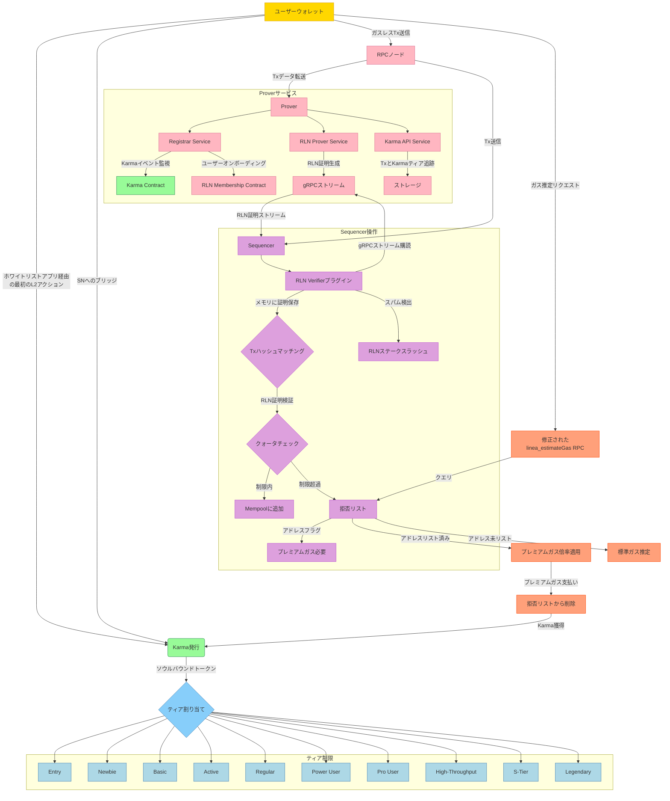

# Status Networkのガスレストランザクション

Status Networkは大規模なガスレストランザクションの導入を目指しています。このガスレスアプローチの主要コンポーネントは、VacのRate Limiting Nullifierで、従来のガス手数料を必要とせずにトランザクション速度制限を可能にします。この文書では、ガスレストランザクションを安全に有効にするために必要なアーキテクチャと統合要素について説明します。

ガスレストランザクションの実装コードは、[Status Networkモノレポ](https://github.com/status-im/status-network-monorepo?tab=readme-ov-file#architecture-components)で利用可能です。

ガスレスの運用レベルの実装についての詳細は、[Karma統合ガイド](/build-for-karma/guides)を参照してください。

## RLN

RLNは、違反が発生しない限りユーザーのプライバシーを損なうことなくスパムを防ぐように設計されたゼロ知識システムです。ZKPとShamirの秘密分散を通じて実行される暗号化速度制限で従来のガス手数料を置き換えます。

RLNの特徴：

- **ゼロ知識証明：** ユーザーは自分のアイデンティティを明かすことなくRLNグループメンバーシップを検証するZKPを生成します。グループメンバーシップは各ティアの最大ガスレストランザクション処理能力を示します。
- **Shamirの秘密分散とNullifier：** ユーザーはトランザクションの一意のnullifierを生成するために使用される秘密鍵を保持します。ユーザーがエポック（ブロックやタイムスタンプなど）内でトランザクション制限を超えると、秘密鍵が回復可能になり、露出します。
- **スパム検出：** 制限を超えるユーザーは効果的に自分の秘密を明かすことになり、拒否リストへの追加、将来の高いガス費用、または潜在的なトークンスラッシングなどのペナルティを受けます。

### RLNメンバーシップ管理

RLNは大規模なメンバーシップ証明を効率的に処理するためにスパースマークルツリーを使用します。ベンチマーク研究により、100万アカウントをサポートする高さ20のツリーが証明生成と検証に最適なパフォーマンスを提供することが判明しました。100万アカウントを超えるスケーラビリティのために、レジストリと共に複数のSMTを使用してユーザーを適切なツリーに誘導できます。

ProverにはKarmaが新しいアドレスに割り当てられるKarma Contractからのイベントを監視するRegistrar Serviceが含まれています。そのようなイベントを検出すると、Registrar ServiceはRLN認証情報（identitySecretHashとidentityCommitment）を生成して登録し、ユーザーをRLN Membership Contractにオンボーディングします。RLN Prover Serviceはトランザクションの証明を生成し、gRPCを介してSequencerのRLN Verifierにストリーミングされます。Verifierはこれらの証明をメモリに保存し、プロセスが非同期であるため、トランザクションハッシュに基づいて受信トランザクションと照合します。

## システムコンポーネント

### Prover

Proverは3つのサービスで構成されるシステムです：

1. **Registrar Service**: Karma ContractからKarma割り当てイベントを監視します。新しいアドレスがKarmaを受け取ると、RLN認証情報を生成して登録し、ユーザーをRLN Membership Contractにオンボーディングします。
2. **RLN Prover Service**: Zerokitライブラリを使用してトランザクションのRLN証明を生成します。証明はgRPCストリームを介してSequencerのRLN Verifierに直接ストリーミングされます。
3. **Karma API Service**: エポック内でユーザーが行ったトランザクションを追跡し、Karmaティアステータスを維持します。効率的なクエリとティア管理のために内部データベースにトランザクションデータを保存します。

これらのサービスは安全な認証情報管理、証明生成、トランザクション追跡を保証し、gRPCがSequencerとの低遅延通信を可能にします。

### RLN Verifier

RLN Verifierはsequencer内のbesuプラグインで、Java Native Interfaceを介してRLNのZerokit Rustライブラリを活用します。
Verifierは：

- RLN Prover ServiceからgRPCストリームを購読して生成されるRLN証明を受信します。
- 証明をメモリに保存し、トランザクション（RPCノード経由）と証明（gRPC経由）の非同期到着を考慮して、トランザクションハッシュに基づいて受信トランザクションと照合します。
- 証明の真正性、nullifierの一意性、ユーザートランザクションクォータを検証します。

検証に失敗したトランザクションは拒否され、ユーザーは一時的に拒否リストに追加される場合があります。

### 拒否リスト

拒否リストはクォータを超過したりスパムに関与したりするユーザーを一時的に制限します：

- エントリは処理能力ティアに基づいて設定された期間（時間や日など）後に期限切れになります
- ユーザーはプレミアムガス手数料を支払うことで制限を回避できます
- プレミアム手数料を支払うとユーザーがリストから削除され、追加のKarmaを獲得します

## `linea_estimateGas` RPC修正

Status Networkは、ベースのLinea `linea_estimateGas`をKarma対応の動作で拡張しており、返される**手数料フィールド**は送信者アドレス`from`のKarma残高に依存する場合があります。
`gasLimit`の計算は、ベースのLinea実装（内部的に標準の`eth_estimateGas`ロジックを使用）から変更されていません。

具体的には、Status Networkの`linea_estimateGas`は：

- **拒否リストプレミアムの適用**: 送信者が拒否リストに掲載されている場合、ノードは通常の手数料見積もりを計算し、**手数料フィールド**にプレミアム倍率を適用します。
- **対象ユーザーへのガスレス見積もりの返却**: 送信者に利用可能なKarmaクォータがある場合、メソッドはゼロの`baseFeePerGas`と`priorityFeePerGas`を返します。

上記のロジックは、[Status Networkモノレポのこのセクション](https://github.com/status-im/status-network-monorepo/blob/v1.0.1/besu-plugins/linea-sequencer/sequencer/src/main/java/net/consensys/linea/rpc/methods/LineaEstimateGas.java#L218)でオープンソース化されている修正版`LineaEstimateGas`実装に含まれています。

Karma対応の手数料見積もり動作と`linea_estimateGas`の詳細については、[JSON-RPC API](/tools/rpc/json-rpc)を参照してください。
