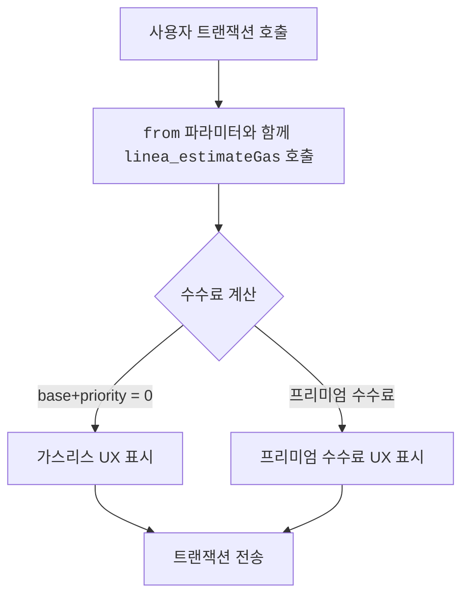

import Tabs from '@theme/Tabs';
import TabItem from '@theme/TabItem';

Status Network는 프로토콜 레벨에서 가스리스 트랜잭션을 제공합니다. 페이마스터나 릴레이어가 필요하지 않습니다. 빌더로서 핵심 작업은 sender의 상태에 따라 수수료를 정확하게 추정하고 표시하는 것입니다.

:::important 핵심 규칙
트랜잭션 UX를 준비할 때 신뢰할 수 있는 가스비 값 출처로 `linea_estimateGas` RPC 메서드를 사용하세요.
:::

기타 JSON-RPC 메서드 레퍼런스는 [JSON-RPC API](/build-for-karma/rpc/json-rpc)를 참조하세요.

## 카르마가 적용된 수수료 추정법

Linea에서 [`linea_estimateGas`](https://docs.linea.build/api/reference/linea-estimategas)는 이미 가스 추정을 위한 권장 방법입니다.
**단일 호출**에서 `gasLimit`, `baseFeePerGas`, `priorityFeePerGas`를 반환하며, 수수료 관련 필드들은 압축된 트랜잭션의 크기, L1 검증 비용, L1/L2 가스 가격 비율을 반영합니다. 이는 `eth_` 네임스페이스 메서드에는 적용되지 않은 요소들입니다.

Status Network는 `linea_estimateGas`를 더욱 확장하여 수수료 필드에 **카르마 시스템**을 반영합니다. 자격이 있는 사용자의 경우 수수료가 0으로 줄어들 수 있고, 거부 목록에 있는 사용자의 수수료는 증가할 수 있습니다.



*그림: `linea_estimateGas`를 사용한 가스 추정 플로우*

이것이 빌더가 Status Network에서 트랜잭션 비용을 추정하거나 사용자를 위한 EIP-1559 수수료 필드를 입력해줄 때 `linea_estimateGas`를 사용해야 하는 이유입니다.

:::info 자세히 보기
카르마와 가스비 및 트랜잭션 권한에 미치는 영향에 대한 자세한 설명은 [카르마 토크노믹스](../../overview/tokenomics/karmic-tokenomics) 페이지를 참조하세요.

가스리스 시스템이 어떻게 구현되고 적용되는지에 대한 기술적 세부사항은 [가스리스 트랜잭션](../../overview/general-info/gasless-transactions) 문서를 참조하세요.
:::

## `linea_estimateGas` 요청/응답 형태

### 요청

`linea_estimateGas`는 `eth_estimateGas`와 **동일한 트랜잭션 호출 객체**를 받습니다.
`gasLimit`(`eth_estimateGas`와 동일한 EVM 실행 로직 사용)과 함께 Linea의 L2 전용 가격 책정과 Status Network의 카르마 규칙을 모두 반영한 수수료 필드를 단일 응답으로 반환합니다.

:::important
**항상 `from`을 포함하세요.** 해당 값이 없으면 노드가 카르마/할당량/거부 목록 로직을 적용할 수 없습니다.
:::

### 응답

`linea_estimateGas`는 다음을 포함하는 객체를 반환합니다:

- `gasLimit`: 16진수 숫자값 - EVM 실행을 위한 추정 가스 단위(`eth_estimateGas`와 동일한 계산 결과)
- `baseFeePerGas`: 16진수 숫자값 - Status Network의 카르마 규칙을 반영한 다음 블록의 기본 수수료
- `priorityFeePerGas`: 16진수 숫자값 - Status Network의 카르마 규칙을 반영한 제안 우선순위 수수료

이러한 수수료 필드는 `eth_gasPrice`, `eth_maxPriorityFeePerGas`, `eth_feeHistory`와 같은 `eth_` 네임스페이스 호출이 반환하는 값과 크게 다를 수 있습니다. `eth_` 네임스페이스들은 Linea의 L2 전용 가격 책정이나 Status Network의 카르마 조정을 인식하지 못합니다.

<!-- markdownlint-disable MD033 -->
<Tabs groupId="estimate-gas-response-shape">
  <TabItem value="linea" label="linea_estimateGas (단일 호출)">

```json
{
  "jsonrpc": "2.0",
  "id": 1,
  "result": {
    "gasLimit": "0x5208",
    "baseFeePerGas": "0x0",
    "priorityFeePerGas": "0x0"
  }
}
```

  </TabItem>
  <TabItem value="eth" label="표준 EVM (다중 호출)">

표준 EVM 플로우에서는 가스 한도와 수수료 데이터를 수집하기 위해 별도의 `eth_` 호출이 여러 번 필요합니다:

**eth_estimateGas**

```json
{
  "jsonrpc": "2.0",
  "id": 1,
  "result": "0x5208"
}
```

**eth_maxPriorityFeePerGas**

```json
{
  "jsonrpc": "2.0",
  "id": 2,
  "result": "0x59682f00"
}
```

**eth_getBlockByNumber**

```json
{
  "jsonrpc": "2.0",
  "id": 3,
  "result": {
    "number": ...,
    "baseFeePerGas": "0x3b9aca00",
    ...
  }
}
```

  </TabItem>
</Tabs>
<!-- markdownlint-enable MD033 -->

## 마이그레이션 안내: 다중 `eth_` 호출에서 단일 `linea_estimateGas`로

이 섹션은 일반적인 "다중 `eth_` 호출을 통한 EIP-1559" 플로우에서 단일 `linea_estimateGas` 호출로 마이그레이션하는 방법을 보여줍니다. Status Network에서의 더 정확한 L2 전용 수수료 데이터와 카르마 인식 가격 책정을 제공합니다.

### 이전: `eth_` 네임스페이스를 사용한 일반적인 EVM 체인의 EIP-1559 추정 플로우

많은 EVM 체인에서 일반적인 EIP-1559 추정 플로우는 다음과 같습니다:

1. **가스 한도 추정** — `eth_estimateGas`
2. **`maxPriorityFeePerGas` 조회** — `eth_maxPriorityFeePerGas` 및 `eth_feeHistory`
3. **`baseFeePerGas` 조회** — `eth_getBlockByNumber`
4. 위 값들을 조합하여 EIP-1559 트랜잭션 구성:
   - `gas`
   - `maxPriorityFeePerGas`
   - `maxFeePerGas`, 일반적으로 $2 \cdot \mathrm{baseFeePerGas} + \mathrm{maxPriorityFeePerGas}$

<!-- markdownlint-disable MD033 -->
<Tabs groupId="eip1559-estimation-before">
  <TabItem value="curl" label="curl">

```bash
# 1) Gas limit (EVM execution)
curl -X POST -H "Content-Type: application/json" \
  --data '{
    "jsonrpc":"2.0",
    "id":1,
    "method":"eth_estimateGas",
    "params":[{
      "from":"0xYOUR_SENDER",
      "to":"0xCONTRACT_OR_RECIPIENT",
      "data":"0xYOUR_CALLDATA",
      "value":"0x0"
    }]
  }' \
  https://YOUR_RPC_URL

# 2) Fetch suggested tip amount
curl -X POST -H "Content-Type: application/json" \
  --data '{"jsonrpc":"2.0","id":2,"method":"eth_maxPriorityFeePerGas","params":[]}' \
  https://YOUR_RPC_URL

# 3) Fetch base fee
curl -X POST -H "Content-Type: application/json" \
  --data '{"jsonrpc":"2.0","id":3,"method":"eth_getBlockByNumber","params":["pending",false]}' \
  https://YOUR_RPC_URL
```

  </TabItem>
  <TabItem value="ethers" label="ethers.js">

```js
import { ethers } from 'ethers';

const provider = new ethers.JsonRpcProvider('https://YOUR_RPC_URL');

const call = {
  from: '0xYOUR_SENDER',
  to: '0xCONTRACT_OR_RECIPIENT',
  data: '0xYOUR_CALLDATA',
  value: '0x0',
};

const gas = await provider.estimateGas(call);
const maxPriorityFeePerGas = await provider.send('eth_maxPriorityFeePerGas', []);
const pendingBlock = await provider.getBlock('pending');

const baseFeePerGas = pendingBlock?.baseFeePerGas ?? 0n;
const maxFeePerGas = 2n * baseFeePerGas + BigInt(maxPriorityFeePerGas);

console.log({
  gas: `0x${gas.toString(16)}`,
  maxPriorityFeePerGas,
  maxFeePerGas: `0x${maxFeePerGas.toString(16)}`,
});
```

  </TabItem>
  <TabItem value="viem" label="viem">

```js
import { createPublicClient, http } from 'viem';

const client = createPublicClient({
  transport: http('https://YOUR_RPC_URL'),
});

const call = {
  account: '0xYOUR_SENDER',
  to: '0xCONTRACT_OR_RECIPIENT',
  data: '0xYOUR_CALLDATA',
  value: 0n,
};

const gas = await client.estimateGas(call);
const maxPriorityFeePerGas = await client.getMaxPriorityFeePerGas();
const pendingBlock = await client.getBlock({ blockTag: 'pending' });

const baseFeePerGas = pendingBlock.baseFeePerGas ?? 0n;
const maxFeePerGas = 2n * baseFeePerGas + maxPriorityFeePerGas;

console.log({
  gas,
  maxPriorityFeePerGas,
  maxFeePerGas,
});
```

  </TabItem>
</Tabs>
<!-- markdownlint-enable MD033 -->

### 이후: `linea_estimateGas`를 사용한 Status Network 가스 추정 플로우

Status Network에서는 `linea_estimateGas`를 통해 수수료 제안을 가져와야 합니다. 정확한 수수료 추천이 트랜잭션 전송자의 카르마 보유량에 따라 달라지기 때문입니다:

- 계정이 **가스리스** 트랜잭션 대상일 수 있습니다
- 거부 목록에 있는 계정은 **프리미엄 가스비**를 지불해야 할 수 있습니다

<!-- markdownlint-disable MD033 -->
<Tabs groupId="linea-estimate-gas-request">
  <TabItem value="curl" label="curl">

```bash
curl -X POST -H "Content-Type: application/json" \
  --data '{
    "jsonrpc":"2.0",
    "id":1,
    "method":"linea_estimateGas",
    "params":[{
      "from":"0xYOUR_SENDER",
      "to":"0xCONTRACT_OR_RECIPIENT",
      "data":"0xYOUR_CALLDATA",
      "value":"0x0"
    }]
  }' \
  https://YOUR_STATUS_NETWORK_RPC_URL
```

  </TabItem>
  <TabItem value="ethers" label="ethers.js">

```js
import { ethers } from 'ethers';

const provider = new ethers.JsonRpcProvider('https://YOUR_STATUS_NETWORK_RPC_URL');

const call = {
  from: '0xYOUR_SENDER',
  to: '0xCONTRACT_OR_RECIPIENT',
  data: '0xYOUR_CALLDATA',
  value: '0x0',
};

const { gasLimit, baseFeePerGas, priorityFeePerGas } = await provider.send(
  'linea_estimateGas',
  [call],
);

const maxFeePerGas =
  BigInt(baseFeePerGas) + BigInt(priorityFeePerGas);

console.log({
  gas: gasLimit,
  maxPriorityFeePerGas: priorityFeePerGas,
  maxFeePerGas: `0x${maxFeePerGas.toString(16)}`,
});
```

  </TabItem>
  <TabItem value="viem" label="viem">

```js
import { createPublicClient, http } from 'viem';

const client = createPublicClient({
  transport: http('https://YOUR_STATUS_NETWORK_RPC_URL'),
});

const call = {
  from: '0xYOUR_SENDER',
  to: '0xCONTRACT_OR_RECIPIENT',
  data: '0xYOUR_CALLDATA',
  value: 0n,
};

const { gasLimit, baseFeePerGas, priorityFeePerGas } = await client.request({
  method: 'linea_estimateGas',
  params: [call],
});

const maxFeePerGas =
  BigInt(baseFeePerGas) + BigInt(priorityFeePerGas);

console.log({
  gas: gasLimit,
  maxPriorityFeePerGas: priorityFeePerGas,
  maxFeePerGas: `0x${maxFeePerGas.toString(16)}`,
});
```

  </TabItem>
</Tabs>
<!-- markdownlint-enable MD033 -->

:::tip 툴링 구현
많은 이더리움 라이브러리가 내부적으로 `eth_estimateGas`를 호출합니다(예: `provider.estimateGas(...)`). Status Network에서는 표준 `eth_` 메서드에 대해 해당 라이브러리 사용을 유지하되, 사용자를 위한 트랜잭션 파라미터를 구성하거나 표시할 때만은 **가스 한도와 수수료 필드를 `linea_estimateGas`를 통해 명시적으로 가져오는 것을 권고합니다.**.
:::

## UI에서의 수수료 처리 시나리오

### 1) 가스리스

`baseFeePerGas`와 `priorityFeePerGas`가 모두 0일 때:

- 명확한 무료 트랜잭션 상태를 표시합니다.
- 불필요한 수수료 경고를 건너뜁니다.

### 2) 프리미엄 수수료

sender가 거부 목록에 있을 때(할당량 초과 또는 RLN 정책):

- 수수료 금액을 표시하고 할당량 초과 또는 스팸 정책으로 인해 프리미엄 가스가 적용됨을 설명합니다.
- sender가 수수료를 지불하거나 할당량 기간이 갱신될 때까지 기다릴 수 있음을 명확히 합니다.
- 프리미엄 가스를 지불할 의향이 있다면 트랜잭션 전송이 가능하도록 유지합니다. 완전히 차단하지 마세요.

## 주로 빠지는 함정들

| 함정 | 해결법 |
|---|---|
| 수수료 결정에 `eth_` 메서드 사용(`eth_gasPrice`, `eth_maxPriorityFeePerGas`, `eth_feeHistory`) | `linea_estimateGas` 사용 |
| `linea_estimateGas` 호출 시 `from` 생략 | 카르마가 적용된 추정값을 받으려면 항상 sender 주소를 전달 |
| 수수료값을 가정하여 하드코딩 | 반환된 `baseFeePerGas`와 `priorityFeePerGas` 값으로 수수료 UI 구성 |
| 모든 트랜잭션이 가스리스라고 가정 | 가스리스(수수료 0)와 거부 목록(프리미엄 수수료) 각각 처리 |
| 재시도 시 가스비 추정값 캐싱 | 전송 시점 인근에 재추정 필요 — sender의 카르마 상태가 변경될 수 있음 |

## 다음 단계

- [JSON-RPC API](/build-for-karma/rpc/json-rpc)
- [평판 적용하기](/build-for-karma/guides/reputation-integration)
