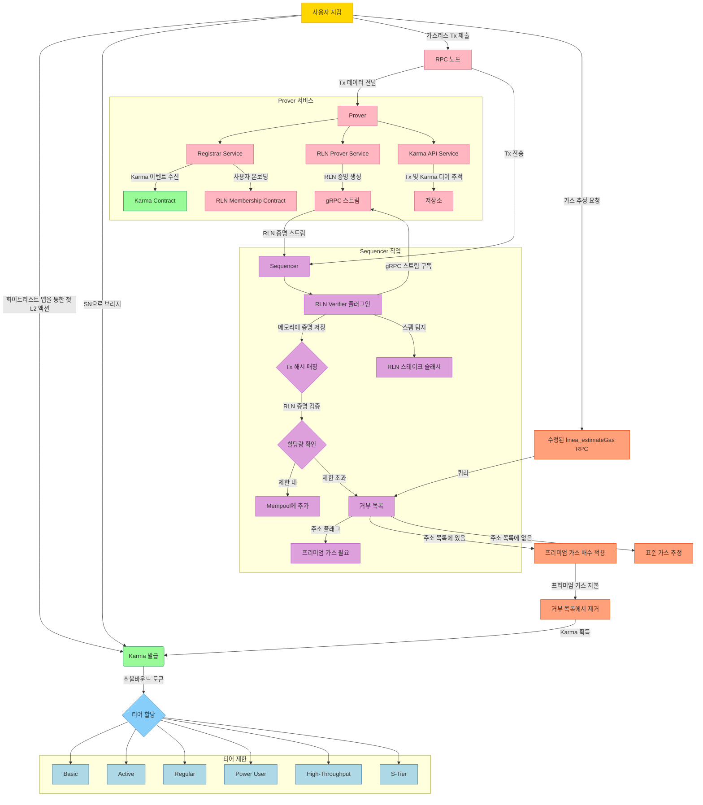

# Status Network의 가스리스 트랜잭션

Status Network는 대규모 가스리스 트랜잭션 도입을 목표로 합니다. 이 가스리스 접근 방식의 핵심 구성 요소는 Vac의 Rate Limiting Nullifier로, 기존 가스 수수료 없이도 트랜잭션 속도 제한을 가능하게 합니다. 이 문서는 가스리스 트랜잭션을 안전하게 활성화하는 데 필요한 아키텍처와 통합 요소를 설명합니다.

### 1.2 RLN

RLN은 위반이 발생하지 않는 한 사용자 프라이버시를 손상시키지 않으면서 스팸을 방지하도록 설계된 영지식 시스템입니다. ZKP와 Shamir의 비밀 공유를 통해 시행되는 암호화 속도 제한으로 기존 가스 수수료를 대체합니다.

RLN 특성:

- **영지식 증명:** 사용자는 자신의 신원을 공개하지 않고 RLN 그룹 멤버십을 확인하는 ZKP를 생성합니다. 그룹 멤버십은 각 티어의 최대 가스리스 트랜잭션 처리량을 나타냅니다.
- **Shamir의 비밀 공유 및 Nullifier:** 사용자는 트랜잭션에 대한 고유한 nullifier를 생성하는 데 사용되는 비밀 키를 보유합니다. 사용자가 에포크(예: 블록 또는 타임스탬프) 내에서 트랜잭션 제한을 초과하면 비밀 키가 복구 가능해져 노출됩니다.
- **스팸 탐지:** 제한을 초과하는 사용자는 효과적으로 자신의 비밀을 공개하게 되어 거부 목록 포함, 향후 높은 가스 비용 또는 잠재적인 토큰 슬래싱과 같은 처벌을 받게 됩니다.

### 1.3. RLN 멤버십 관리

RLN은 대규모 멤버십 증명을 효율적으로 처리하기 위해 희소 머클 트리를 사용합니다. 벤치마킹 연구에 따르면 100만 계정을 지원하는 높이 20의 트리가 증명 생성 및 검증에 최적의 성능을 제공합니다. 100만 계정을 초과하는 확장성을 위해 레지스트리와 함께 여러 SMT를 사용하여 사용자를 적절한 트리로 안내할 수 있습니다.

Prover에는 Karma가 새 주소에 할당되는 Karma Contract의 이벤트를 수신하는 Registrar Service가 포함됩니다. 이러한 이벤트를 감지하면 Registrar Service는 RLN 자격 증명(identitySecretHash 및 identityCommitment)을 생성하고 등록하여 사용자를 RLN Membership Contract에 온보딩합니다. RLN Prover Service는 트랜잭션에 대한 증명을 생성하고, 이는 gRPC를 통해 Sequencer의 RLN Verifier로 스트리밍됩니다. Verifier는 이러한 증명을 메모리에 저장하고 프로세스가 비동기적이므로 트랜잭션 해시를 기반으로 들어오는 트랜잭션과 일치시킵니다.

## 3. 시스템 구성 요소

### 3.1 Prover

Prover는 세 가지 서비스로 구성된 시스템입니다:

1. **Registrar Service**: Karma Contract에서 Karma 할당 이벤트를 수신합니다. 새 주소가 Karma를 받으면 RLN 자격 증명을 생성하고 등록하여 사용자를 RLN Membership Contract에 온보딩합니다.
2. **RLN Prover Service**: Zerokit 라이브러리를 사용하여 트랜잭션에 대한 RLN 증명을 생성합니다. 증명은 gRPC 스트림을 통해 Sequencer의 RLN Verifier로 직접 스트리밍됩니다.
3. **Karma API Service**: 에포크 내에서 사용자가 수행한 트랜잭션을 추적하고 Karma 티어 상태를 유지합니다. 효율적인 쿼리 및 티어 관리를 위해 트랜잭션 데이터를 내부 데이터베이스에 저장합니다.

이러한 서비스는 안전한 자격 증명 관리, 증명 생성 및 트랜잭션 추적을 보장하며, gRPC는 Sequencer와의 저지연 통신을 가능하게 합니다.

### 3.2 RLN Verifier

RLN Verifier는 sequencer 내부의 besu 플러그인으로, Java Native Interface를 통해 RLN의 Zerokit Rust 라이브러리를 활용합니다. 
Verifier는:

- RLN Prover Service에서 gRPC 스트림을 구독하여 생성되는 RLN 증명을 수신합니다.
- 증명을 메모리에 저장하고 트랜잭션(RPC 노드를 통해)과 증명(gRPC를 통해)의 비동기 도착을 고려하여 트랜잭션 해시를 기반으로 들어오는 트랜잭션과 일치시킵니다.
- 증명 진위성, nullifier 고유성 및 사용자 트랜잭션 할당량을 확인합니다.

검증에 실패한 트랜잭션은 거부되며, 사용자는 일시적으로 거부 목록에 추가될 수 있습니다.

### 3.3 거부 목록

거부 목록은 할당량을 초과하거나 스팸에 참여하는 사용자를 일시적으로 제한합니다:

- 항목은 처리량 티어에 따라 설정된 기간(예: 시간 또는 일) 후에 만료됩니다
- 사용자는 프리미엄 가스 수수료를 지불하여 제한을 우회할 수 있습니다
- 프리미엄 수수료를 지불하면 사용자가 목록에서 제거되고 추가 Karma를 획득합니다

### 3.4 `linea_estimateGas` RPC 수정

linea_estimateGas 메서드는 거부 목록의 사용자를 고려하도록 사용자 정의됩니다:

- 사용자의 거부 목록 상태를 확인합니다
- 필요한 경우 프리미엄 가스 배수를 추가합니다
- 사용자에게 투명성과 정확한 가스 추정을 제공합니다 