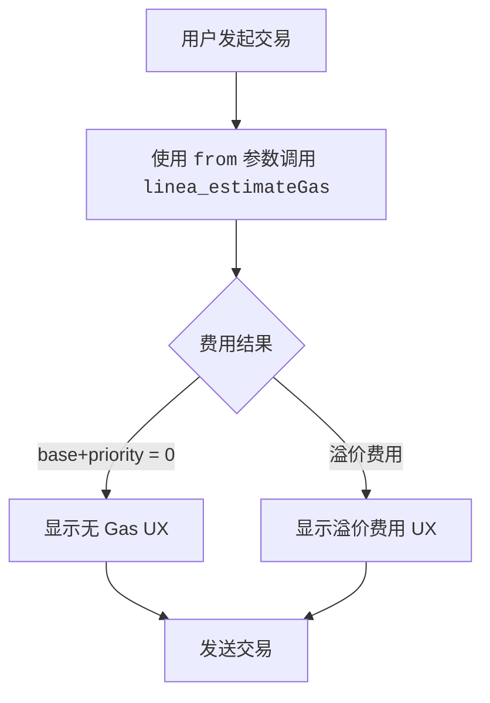

import Tabs from '@theme/Tabs';
import TabItem from '@theme/TabItem';

Status Network 在协议层面提供无 Gas 交易。你不需要 paymasters 或中继器。作为开发者，核心任务是根据发送方状态正确地估算和展示费用。

:::important 核心规则
使用 `linea_estimateGas` RPC 方法作为准备交易 UX 时 Gas 费用的唯一数据来源。
:::

其他 JSON-RPC 方法参考，请参阅 [JSON-RPC API](/build-for-karma/rpc/json-rpc)。

## 具有 Karma 感知能力的费用估算

在 Linea 上，[`linea_estimateGas`](https://docs.linea.build/api/reference/linea-estimategas) 已经是估算 Gas 的推荐方式。
它在**单次调用**中返回 `gasLimit`、`baseFeePerGas` 和 `priorityFeePerGas`，其中费用字段已考虑了压缩交易大小、L1 验证成本以及 L1/L2 Gas 价格比率——这些是 `eth_` 命名空间方法无法捕获的因素。

Status Network 进一步扩展了 `linea_estimateGas`，使其费用字段同时纳入我们的 **Karma** 系统；符合条件的用户费用可能降为零，而被列入拒绝名单的用户费用则可能增加。



*图示：使用 `linea_estimateGas` 的 Gas 估算流程*

这就是为什么开发者在 Status Network 上估算交易成本或为用户预填 EIP-1559 费用字段时，应该使用 `linea_estimateGas`。

:::info 更多信息
关于 Karma 及其对 Gas 费用和交易特权影响的详细说明，请参阅 [Karmic 代币经济学](../../overview/tokenomics/karmic-tokenomics) 页面。

关于我们无 Gas 系统如何实现和执行的技术细节，请参阅[无 Gas 交易](../../overview/general-info/gasless-transactions)文档。
:::

## `linea_estimateGas` 请求/响应结构

### 请求

`linea_estimateGas` 接受与 `eth_estimateGas` 相同的**交易调用对象**。
它使用与 `eth_estimateGas` 相同的 EVM 执行逻辑返回 `gasLimit`，同时返回反映 Linea L2 专属定价和 Status Network Karma 规则的费用字段——全部在单次响应中完成。

:::important
**始终包含 `from`。** 没有它，节点无法应用 Karma/配额/拒绝名单逻辑。
:::

### 响应

`linea_estimateGas` 返回的对象包含：

- `gasLimit`：十六进制数量——EVM 执行的估算 Gas 单位（与 `eth_estimateGas` 计算方式相同）
- `baseFeePerGas`：十六进制数量——下一个区块的基础费用，已考虑 Status Network 上的 Karma 规则
- `priorityFeePerGas`：十六进制数量——建议的优先费用，已考虑 Status Network 上的 Karma 规则

这些费用字段可能与 `eth_` 命名空间调用（如 `eth_gasPrice`、`eth_maxPriorityFeePerGas` 或 `eth_feeHistory`）返回的值有显著差异——后者不了解 Linea 的 L2 专属定价或 Status Network 的 Karma 调整。

<!-- markdownlint-disable MD033 -->
<Tabs groupId="estimate-gas-response-shape">
  <TabItem value="linea" label="linea_estimateGas（单次调用）">

```json
{
  "jsonrpc": "2.0",
  "id": 1,
  "result": {
    "gasLimit": "0x5208",
    "baseFeePerGas": "0x0",
    "priorityFeePerGas": "0x0"
  }
}
```

  </TabItem>
  <TabItem value="eth" label="标准 EVM（多次调用）">

标准 EVM 流程需要多次独立的 `eth_` 调用来获取 Gas 限制和费用数据：

**eth_estimateGas**

```json
{
  "jsonrpc": "2.0",
  "id": 1,
  "result": "0x5208"
}
```

**eth_maxPriorityFeePerGas**

```json
{
  "jsonrpc": "2.0",
  "id": 2,
  "result": "0x59682f00"
}
```

**eth_getBlockByNumber**

```json
{
  "jsonrpc": "2.0",
  "id": 3,
  "result": {
    "number": ...,
    "baseFeePerGas": "0x3b9aca00",
    ...
  }
}
```

  </TabItem>
</Tabs>
<!-- markdownlint-enable MD033 -->

## 迁移指南：从多次 `eth_` 调用迁移到 `linea_estimateGas`

本节介绍如何从常见的"通过多次 `eth_` 调用实现 EIP-1559"流程迁移到单次 `linea_estimateGas` 调用，后者能在 Status Network 上提供更准确的 L2 专属费用数据和 Karma 感知定价。

### 迁移前：使用 `eth_` 命名空间的常见 EIP-1559 估算流程

在许多 EVM 链上，典型的 EIP-1559 估算流程如下：

1. 通过 `eth_estimateGas` **估算 Gas 限制**
2. 通过 `eth_maxPriorityFeePerGas` 和/或 `eth_feeHistory` **获取 `maxPriorityFeePerGas`**
3. 通过 `eth_getBlockByNumber` **获取 `baseFeePerGas`**
4. 构建 EIP-1559 交易，使用：
   - `gas`
   - `maxPriorityFeePerGas`
   - `maxFeePerGas`，通常为 $2 \cdot \mathrm{baseFeePerGas} + \mathrm{maxPriorityFeePerGas}$

<!-- markdownlint-disable MD033 -->
<Tabs groupId="eip1559-estimation-before">
  <TabItem value="curl" label="curl">

```bash
# 1) Gas 限制（EVM 执行）
curl -X POST -H "Content-Type: application/json" \
  --data '{
    "jsonrpc":"2.0",
    "id":1,
    "method":"eth_estimateGas",
    "params":[{
      "from":"0xYOUR_SENDER",
      "to":"0xCONTRACT_OR_RECIPIENT",
      "data":"0xYOUR_CALLDATA",
      "value":"0x0"
    }]
  }' \
  https://YOUR_RPC_URL

# 2) 获取建议小费金额
curl -X POST -H "Content-Type: application/json" \
  --data '{"jsonrpc":"2.0","id":2,"method":"eth_maxPriorityFeePerGas","params":[]}' \
  https://YOUR_RPC_URL

# 3) 获取基础费用
curl -X POST -H "Content-Type: application/json" \
  --data '{"jsonrpc":"2.0","id":3,"method":"eth_getBlockByNumber","params":["pending",false]}' \
  https://YOUR_RPC_URL
```

  </TabItem>
  <TabItem value="ethers" label="ethers.js">

```js
import { ethers } from 'ethers';

const provider = new ethers.JsonRpcProvider('https://YOUR_RPC_URL');

const call = {
  from: '0xYOUR_SENDER',
  to: '0xCONTRACT_OR_RECIPIENT',
  data: '0xYOUR_CALLDATA',
  value: '0x0',
};

const gas = await provider.estimateGas(call);
const maxPriorityFeePerGas = await provider.send('eth_maxPriorityFeePerGas', []);
const pendingBlock = await provider.getBlock('pending');

const baseFeePerGas = pendingBlock?.baseFeePerGas ?? 0n;
const maxFeePerGas = 2n * baseFeePerGas + BigInt(maxPriorityFeePerGas);

console.log({
  gas: `0x${gas.toString(16)}`,
  maxPriorityFeePerGas,
  maxFeePerGas: `0x${maxFeePerGas.toString(16)}`,
});
```

  </TabItem>
  <TabItem value="viem" label="viem">

```js
import { createPublicClient, http } from 'viem';

const client = createPublicClient({
  transport: http('https://YOUR_RPC_URL'),
});

const call = {
  account: '0xYOUR_SENDER',
  to: '0xCONTRACT_OR_RECIPIENT',
  data: '0xYOUR_CALLDATA',
  value: 0n,
};

const gas = await client.estimateGas(call);
const maxPriorityFeePerGas = await client.getMaxPriorityFeePerGas();
const pendingBlock = await client.getBlock({ blockTag: 'pending' });

const baseFeePerGas = pendingBlock.baseFeePerGas ?? 0n;
const maxFeePerGas = 2n * baseFeePerGas + maxPriorityFeePerGas;

console.log({
  gas,
  maxPriorityFeePerGas,
  maxFeePerGas,
});
```

  </TabItem>
</Tabs>
<!-- markdownlint-enable MD033 -->

### 迁移后：使用 `linea_estimateGas` 的 Status Network Gas 估算流程

在 Status Network 上，你应该从 `linea_estimateGas` 获取费用建议，因为正确的费用推荐取决于 Karma：

- 账户可能有资格获得**无 Gas** 交易
- 被列入拒绝名单的账户可能需要支付**溢价 Gas 费用**

<!-- markdownlint-disable MD033 -->
<Tabs groupId="linea-estimate-gas-request">
  <TabItem value="curl" label="curl">

```bash
curl -X POST -H "Content-Type: application/json" \
  --data '{
    "jsonrpc":"2.0",
    "id":1,
    "method":"linea_estimateGas",
    "params":[{
      "from":"0xYOUR_SENDER",
      "to":"0xCONTRACT_OR_RECIPIENT",
      "data":"0xYOUR_CALLDATA",
      "value":"0x0"
    }]
  }' \
  https://YOUR_STATUS_NETWORK_RPC_URL
```

  </TabItem>
  <TabItem value="ethers" label="ethers.js">

```js
import { ethers } from 'ethers';

const provider = new ethers.JsonRpcProvider('https://YOUR_STATUS_NETWORK_RPC_URL');

const call = {
  from: '0xYOUR_SENDER',
  to: '0xCONTRACT_OR_RECIPIENT',
  data: '0xYOUR_CALLDATA',
  value: '0x0',
};

const { gasLimit, baseFeePerGas, priorityFeePerGas } = await provider.send(
  'linea_estimateGas',
  [call],
);

const maxFeePerGas =
  BigInt(baseFeePerGas) + BigInt(priorityFeePerGas);

console.log({
  gas: gasLimit,
  maxPriorityFeePerGas: priorityFeePerGas,
  maxFeePerGas: `0x${maxFeePerGas.toString(16)}`,
});
```

  </TabItem>
  <TabItem value="viem" label="viem">

```js
import { createPublicClient, http } from 'viem';

const client = createPublicClient({
  transport: http('https://YOUR_STATUS_NETWORK_RPC_URL'),
});

const call = {
  from: '0xYOUR_SENDER',
  to: '0xCONTRACT_OR_RECIPIENT',
  data: '0xYOUR_CALLDATA',
  value: 0n,
};

const { gasLimit, baseFeePerGas, priorityFeePerGas } = await client.request({
  method: 'linea_estimateGas',
  params: [call],
});

const maxFeePerGas =
  BigInt(baseFeePerGas) + BigInt(priorityFeePerGas);

console.log({
  gas: gasLimit,
  maxPriorityFeePerGas: priorityFeePerGas,
  maxFeePerGas: `0x${maxFeePerGas.toString(16)}`,
});
```

  </TabItem>
</Tabs>
<!-- markdownlint-enable MD033 -->

:::tip 工具集成
许多以太坊库在内部调用 `eth_estimateGas`（例如 `provider.estimateGas(...)`）。在 Status Network 上，继续使用这些库进行标准 `eth_` 方法调用，但**在构建或向用户展示交易参数时，显式通过 `linea_estimateGas` 获取 Gas 限制和费用字段**。
:::

## 在 UI 中处理费用场景

### 1) 无 Gas

当 `baseFeePerGas` 和 `priorityFeePerGas` 均为零时：

- 显示清晰的免费交易状态。
- 跳过不必要的费用警告。

### 2) 溢价费用

当发送方被列入拒绝名单（超出配额或 RLN 策略）时：

- 显示费用金额，并说明由于配额或垃圾邮件策略，将收取溢价 Gas 费用。
- 明确告知发送方可以支付费用，或等待配额窗口刷新。
- 保持交易可执行；不要强制阻止。

## 常见陷阱

| 陷阱 | 解决方案 |
|---|---|
| 使用 `eth_` 方法进行费用决策（`eth_gasPrice`、`eth_maxPriorityFeePerGas`、`eth_feeHistory`） | 使用 `linea_estimateGas` |
| 调用 `linea_estimateGas` 时省略 `from` | 始终传入发送方地址以获得 Karma 感知的估算 |
| 硬编码费用假设 | 根据返回的 `baseFeePerGas` 和 `priorityFeePerGas` 值构建费用 UI |
| 假设所有用户都是无 Gas 的 | 处理两种状态：无 Gas（零费用）和被拒绝名单（溢价费用） |
| 在重试之间缓存估算值 | 在发送前重新估算——发送方的 Karma 状态可能已发生变化 |

## 下一步

- [JSON-RPC API](/build-for-karma/rpc/json-rpc)
- [声誉集成](/build-for-karma/guides/reputation-integration)
