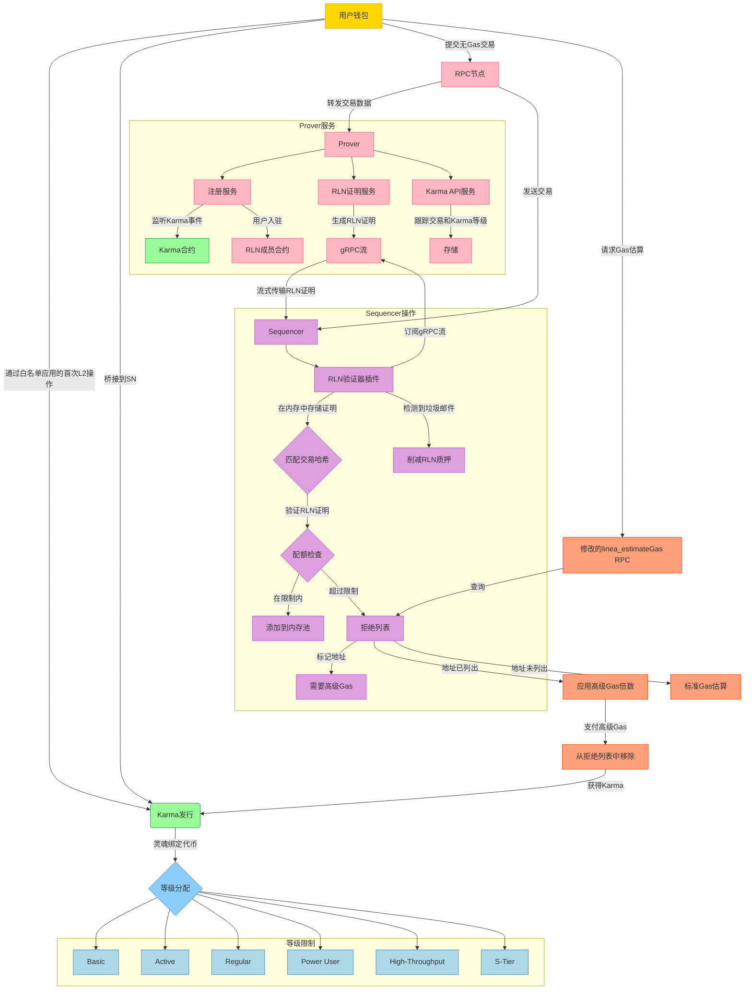

# Status Network的无Gas交易

Status Network旨在大规模引入无Gas交易。这种无Gas方法的关键组件是Vac的速率限制无效器（Rate Limiting Nullifier），它允许在不需要传统Gas费用的情况下进行交易速率限制。本文档描述了安全启用无Gas交易所需的架构和集成元素。

这些无Gas交易的实现代码可在[Status Network代码库](https://github.com/status-im/status-network-monorepo)中找到。

### 1.2 RLN

RLN是一个零知识系统，旨在在不违规的情况下防止垃圾邮件而不损害用户隐私。它通过ZKP和Shamir秘密共享执行的加密速率限制来替代传统的Gas费用。

RLN特征：

- **零知识证明：** 用户生成ZKP来验证他们的RLN组成员身份，而不透露他们的身份。组成员身份表示每个等级的最大无Gas交易吞吐量。
- **Shamir秘密共享和无效器：** 用户持有用于为交易生成唯一无效器的秘密密钥。如果用户在一个时期（例如，区块或时间戳）内超过其交易限制，他们的秘密密钥将变得可恢复，从而暴露他们。
- **垃圾邮件检测：** 超过限制的用户有效地泄露了他们的秘密，导致诸如拒绝列表包含、未来更高的Gas成本或潜在的代币削减等惩罚。

### 1.3. RLN成员管理

RLN使用稀疏默克尔树来高效处理大规模成员证明。基准研究确定，支持100万账户的高度为20的树为证明生成和验证提供了最佳性能。对于超过100万账户的可扩展性，可以使用多个SMT和注册表来引导用户到适当的树。

Prover包括一个注册服务，该服务监听来自Karma合约的事件，其中Karma被分配给新地址。检测到此类事件后，注册服务通过生成和注册其RLN凭据（identitySecretHash和identityCommitment）将用户加入RLN成员合约。RLN证明服务为交易生成证明，这些证明通过gRPC流式传输到Sequencer中的RLN验证器。验证器将这些证明存储在内存中，并基于交易哈希与传入交易匹配，因为该过程是异步的。

## 3. 系统组件

### 3.1 Prover

Prover是一个由三个服务组成的系统：

1. **注册服务**：监听来自Karma合约的Karma分配事件。当新地址收到Karma时，它通过生成RLN凭据并注册它们来将用户加入RLN成员合约。
2. **RLN证明服务**：使用Zerokit库为交易生成RLN证明。证明通过gRPC流直接流式传输到Sequencer中的RLN验证器。
3. **Karma API服务**：跟踪用户在一个时期内进行的交易并维护其Karma等级状态。它将交易数据存储在内部数据库中，以便高效查询和等级管理。

这些服务确保安全的凭据管理、证明生成和交易跟踪，gRPC使与Sequencer的低延迟通信成为可能。

### 3.2 RLN验证器

RLN验证器是sequencer内部的besu插件，通过Java本机接口利用RLN的Zerokit Rust库。
验证器：

- 订阅来自RLN证明服务的gRPC流以接收生成的RLN证明。
- 将证明存储在内存中，并基于交易哈希与传入交易匹配，考虑到交易（通过RPC节点）和证明（通过gRPC）的异步到达。
- 验证证明真实性、无效器唯一性和用户交易配额。

验证失败的交易将被拒绝，用户可能会被临时添加到拒绝列表中。

### 3.3 拒绝列表

拒绝列表临时限制超过配额或参与垃圾邮件的用户：

- 条目根据吞吐量等级在设定的持续时间（例如，小时或天）后过期
- 用户可以通过支付高级Gas费用来绕过限制
- 支付高级费用会将用户从列表中移除并获得额外的Karma

### 3.4 `linea_estimateGas` RPC修改

linea_estimateGas方法被定制以考虑拒绝列表上的用户：

- 检查用户的拒绝列表状态
- 根据需要添加高级Gas倍数
- 为用户提供透明度和准确的Gas估算 